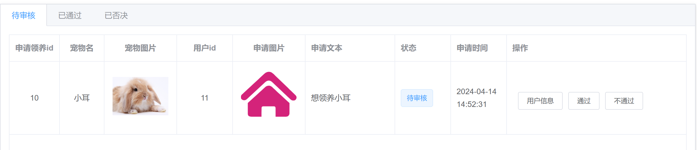
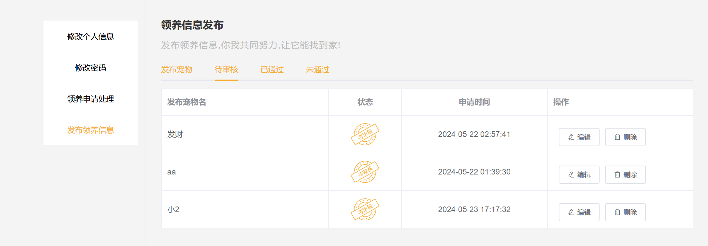
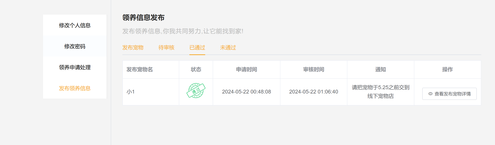

# 宠物领养管理系统 - 详细说明文档
# 源码获取：https://mbd.pub/o/bread/Z5yZmJdq
## 项目概述

宠物领养管理系统是一个基于Web的完整解决方案，包含用户端、管理员端和后端服务。系统采用前后端分离架构，提供宠物信息管理、领养申请、发布管理、知识库等功能。

## 技术栈

### 后端技术栈
- **框架**: Koa 2.14.1 (Node.js)
- **数据库**: MySQL 5.7
- **ORM**: mysql2 3.2.0
- **身份认证**: jsonwebtoken 9.0.0 + koa-session
- **安全**: bcryptjs 2.4.3 (密码加密)
- **文件上传**: formidable 2.1.1
- **验证码**: svg-captcha 1.4.0
- **开发工具**: nodemon 1.19.1

### 前端技术栈 (用户端)
- **框架**: Vue 2.6.14
- **UI组件库**: Element UI 2.15.13
- **状态管理**: Vuex 3.6.2
- **路由**: Vue Router 3.5.1
- **HTTP客户端**: axios 1.3.4
- **地图服务**: vue-baidu-map 0.21.22
- **构建工具**: Vue CLI 5.0.0

### 前端技术栈 (管理员端)
- **框架**: Vue 2.x
- **构建工具**: Vue CLI

## 项目结构

```
graduate-master/
├── pet-management/           # 主项目目录
│   ├── backEnd/            # 后端服务
│   │   ├── app.js         # 应用入口
│   │   ├── bin/www        # 启动脚本
│   │   ├── db/            # 数据库配置
│   │   ├── routes/        # 路由模块
│   │   ├── public/        # 静态资源
│   │   └── views/         # 模板视图
│   ├── frontEnd/          # 用户前端
│   │   ├── src/           # 源代码
│   │   ├── public/        # 公共资源
│   │   └── vue.config.js  # Vue配置
│   └── management-system/ # 管理员前端
│       └── my-vue/        # Vue项目
├── 数据/                   # 数据库文件
│   └── pet_adopt_system/  # 数据库脚本
│       ├── users.sql      # 用户表
│       ├── pets.sql       # 宠物表
│       ├── apply_pet.sql  # 领养申请表
│       ├── publish_pet.sql # 发布表
│       ├── pet_knowledge.sql # 知识库表
│       └── admin.sql      # 管理员表
└── 截图/                   # 系统截图
```

## 数据库设计

### 主要数据表

1. **users表** - 用户信息
   - use_id (主键)
   - username (用户名)
   - phone (手机号)
   - pwd (密码)
   - email (邮箱)
   - address (地址)
   - avatar (头像)

2. **其他核心表**
   - pets - 宠物基本信息
   - apply_pet - 领养申请记录
   - publish_pet - 宠物发布信息
   - pet_knowledge - 宠物知识文章
   - admin - 管理员账户
   - comments - 评论信息

## 功能模块

### 用户端功能
- **用户认证**: 登录/注册/找回密码
- **宠物浏览**: 查看可领养宠物列表
- **宠物筛选**: 按条件筛选宠物
- **领养申请**: 提交领养申请
- **个人中心**: 个人信息管理
- **申请状态**: 查看申请审核进度
- **知识库**: 浏览宠物养护知识
- **评论系统**: 对宠物和文章评论

### 管理员端功能
- **用户管理**: 用户信息审核管理
- **宠物管理**: 宠物信息维护
- **申请审核**: 领养申请审批
- **发布审核**: 宠物发布审核
- **知识管理**: 知识库内容管理
- **数据统计**: 系统数据统计分析

### 后端API模块
- **用户模块** (user.js): 注册、登录、个人信息
- **宠物模块** (pet.js): 宠物CRUD操作
- **领养模块** (adopt.js): 领养申请管理
- **发布模块** (publish.js): 宠物发布管理
- **知识模块** (petknowledge.js): 知识库管理
- **管理员模块** (admin.js): 后台管理功能

## 安装和运行

### 环境要求
- Node.js 14+
- MySQL 5.7+
- npm 或 yarn

### 后端启动步骤
```bash
cd pet-management/backEnd
npm install
npm start          # 生产环境
npm run dev       # 开发环境
```

### 用户前端启动步骤
```bash
cd pet-management/frontEnd
npm install
npm run serve     # 开发服务器 (端口8080)
npm run build     # 生产构建
```

### 管理员前端启动步骤
```bash
cd pet-management/management-system/my-vue
npm install
npm run serve     # 开发服务器 (端口8081)
```

### 数据库初始化
1. 创建数据库: `pet_adopt_system`
2. 执行 `/数据/pet_adopt_system/` 目录下的所有SQL文件
3. 修改后端数据库配置 `/backEnd/db/mydb.js`

## 端口配置

- **后端API**: 3000端口
- **用户前端**: 8080端口
- **管理员前端**: 8081端口

## 安全特性

1. **密码加密**: 使用bcryptjs进行密码哈希加密
2. **JWT认证**: 基于token的身份验证
3. **会话管理**: koa-session实现会话控制
4. **CORS配置**: 跨域请求安全控制
5. **输入验证**: 前后端数据验证

## 开发特性

1. **热重载**: 开发环境支持热更新
2. **代码规范**: ESLint代码质量检查
3. **模块化**: 前后端模块化开发
4. **RESTful API**: 规范的API设计
5. **错误处理**: 统一的错误处理机制

## 部署说明

### 生产环境部署
1. 构建前端项目: `npm run build`
2. 配置生产环境变量
3. 使用PM2管理Node进程: `npm run prd`
4. 配置Nginx反向代理
5. 配置数据库连接池

### 环境变量配置
后端需要配置以下环境变量:
- DATABASE_URL: 数据库连接字符串
- JWT_SECRET: JWT加密密钥
- UPLOAD_PATH: 文件上传路径

## 常见问题

### Q: 安装依赖失败
A: 检查Node.js版本，清除npm缓存后重试

### Q: 数据库连接失败
A: 检查数据库服务是否启动，配置是否正确

### Q: 端口被占用
A: 修改对应配置文件中的端口号

### Q: 图片上传失败
A: 检查上传目录权限和配置

## 项目截图

系统提供了丰富的界面截图，展示了各个功能模块的实际效果：

### 系统架构图
-  - 系统整体用例图
-  - 领养申请实体关系图
-  - 发布管理实体关系图

### 用户界面
-  - 用户登录界面
-  - 首页宠物展示
-  - 宠物筛选功能
-  - 领养申请对话框

### 申请管理
-  - 待审核申请状态
-  - 申请通过状态
-  - 申请未通过状态
-  - 待审核界面
-  - 未通过界面
-  - 已通过界面

### 发布管理
-  - 发布待审核修改
-  - 发布待审核列表
-  - 发布已通过列表
-  - 发布未通过列表

### 后台管理
-  - 管理端申请待审核
-  - 管理端申请已通过
-  - 管理端申请未通过
-  - 管理端发布待审核
-  - 管理端发布已通过
-  - 管理端发布未通过

### 代码示例
-  - 筛选功能代码实现
-  - 代码示例1
-  - 代码示例3
-  - 代码示例4

